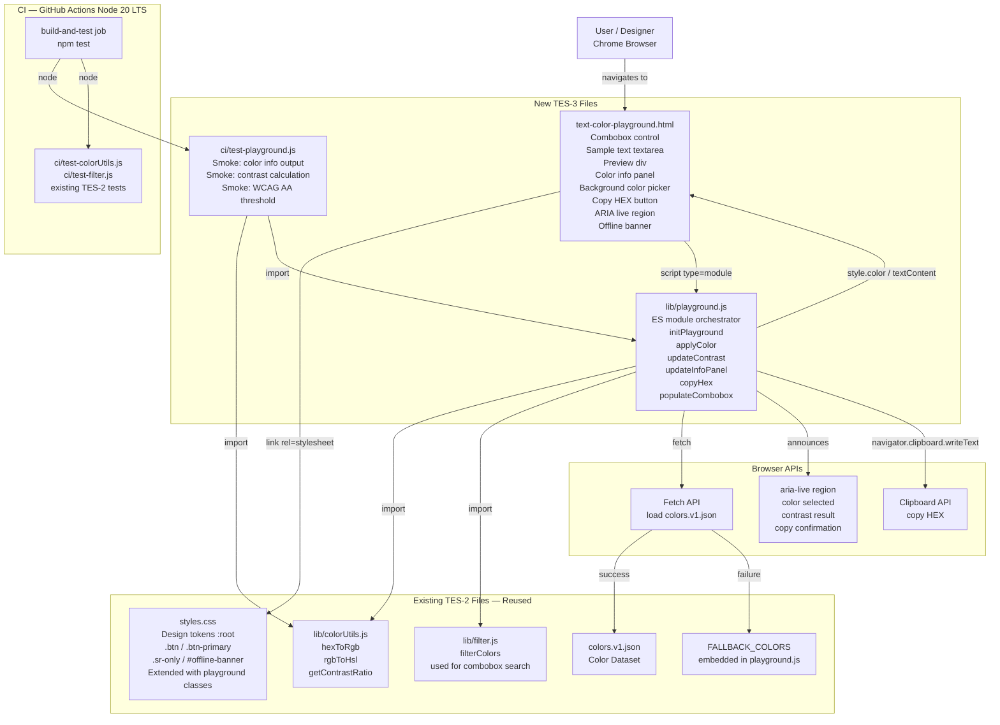

# Architecture: Text Color Playground (TES-3)

_Generated: 2026-09-18_
_Based on: docs/TES-3/requirements.md (JIRA TES-3)_
_Extends: docs/architecture.md (TES-2 Color Palette Explorer)_

---

## 1. Architecture Style

**Zero-dependency static SPA extension** — the same style as TES-2. A new standalone HTML page
(`text-color-playground.html`) is added to the existing static file structure. It shares the
color dataset, utility libraries, and CSS design tokens from TES-2, but has its own JS orchestrator
module. No new build tooling, server configuration, or npm dependencies are required.

This extension approach is chosen because:
- All NFRs (Chrome-only, no backend, static hosting) are identical to TES-2.
- `lib/colorUtils.js` already provides every color-math function TES-3 needs
  (hexToRgb, rgbToHsl, getContrastRatio).
- `colors.v1.json` and the fetch-with-fallback data-loading pattern are directly reusable.
- Adding a second page costs nothing architectural — the static server already serves the whole
  directory.

---

## 2. File Inventory: Reused vs New

| File | Status | Notes |
|---|---|---|
| `lib/colorUtils.js` | **Reused unchanged** | `hexToRgb`, `rgbToHsl`, `getContrastRatio` cover FR-06, FR-07, FR-08 |
| `lib/filter.js` | **Reused unchanged** | `filterColors(colors, query, 'All')` drives combobox inline search (FR-03) |
| `styles.css` | **Extended — additive only** | New playground-specific classes appended at end; all TES-2 classes unchanged |
| `colors.v1.json` | **Reused unchanged** | Same dataset (DEP-01) |
| `app.js` | **Unchanged** | TES-2 orchestrator; not imported by playground |
| `index.html` | **Unchanged** | TES-2 page; not modified (per task constraint) |
| `ci/test-filter.js` | **Unchanged** | Existing TES-2 smoke test |
| `ci/test-colorUtils.js` | **Unchanged** | Existing TES-2 smoke test |
| `.github/workflows/ci.yml` | **Unchanged** | `npm test` already runs all tests; no workflow edits needed |
| `text-color-playground.html` | **NEW** | TES-3 page shell |
| `lib/playground.js` | **NEW** | TES-3 ES module orchestrator |
| `ci/test-playground.js` | **NEW** | TES-3 smoke tests (FR-15) |
| `package.json` | **Modified** | `test` script extended: `... && node ci/test-playground.js` |

---

## 3. Component Diagram



---

## 4. Key Components and Responsibilities

| Component | Technology | Responsibility |
|---|---|---|
| `text-color-playground.html` | HTML5 | Page shell: ARIA combobox markup, `<textarea>` for editable sample text, live preview `<div>`, color info `<dl>` panel, `<input type="color">` for background, Copy HEX `<button>`, `aria-live` region, offline banner |
| `lib/playground.js` | Vanilla JS ES module (ES2020) | Orchestrator: loads and normalises color data (fetch + fallback), populates ARIA combobox, applies selected color as `style.color` on preview text, updates info panel (Name / HEX / RGB / HSL via `textContent`), calculates contrast ratio, evaluates WCAG AA pass/fail, handles background color change, Copy HEX (with `.catch(() => {})`), ARIA live announcements. **Module-level state**: `allColors` (array, normalised dataset), `selectedColor` (object\|null, current selection), `currentBgHex` (string, default `'#FFFFFF'`). **Constraint**: no `document.*` or `window.*` calls at module top level — all DOM access is deferred to function bodies so that Node.js can import this module in CI without a DOM environment (DD-10). |
| `lib/colorUtils.js` | Pure vanilla JS (existing) | `hexToRgb` and `rgbToHsl` for info panel values; `getContrastRatio` for WCAG contrast calculation |
| `lib/filter.js` | Pure vanilla JS (existing) | `filterColors(allColors, query, 'All')` for combobox inline search as user types |
| `styles.css` (extended) | CSS3 (additive) | New classes: `.playground-layout`, `.preview-area`, `.info-panel`, `.contrast-badge`, `.contrast-pass`, `.contrast-fail`, `.combobox-wrapper`, `.combobox-listbox`, `.combobox-option` |
| `ci/test-playground.js` | Node.js (no test framework) | Smoke tests: color selection sets correct hex, `getContrastRatio` returns correct ratio, WCAG AA logic (4.5:1 threshold) passes/fails correctly |
| `package.json` | npm | `test` script extended to include `node ci/test-playground.js` |

---

## 5. Technology Choices

No new technologies are introduced. Every choice traces directly to a NFR or existing constraint.

| Layer | Recommended | Rationale | Alternative Considered |
|---|---|---|---|
| Markup | HTML5 semantic | Native ARIA support; no overhead | — |
| Color dropdown (searchable) | Custom ARIA combobox (`role="combobox"` + `role="listbox"`) | Meets FR-03 (inline search) and NFR-01 (full keyboard nav via ArrowUp/Down, Enter, Escape); native `<select>` has no built-in filtering | `<datalist>` — browser keyboard nav is uncontrollable; dropped. Filtered `<select>` — options cannot be filtered in-place without recreating the element |
| Background color control | `<input type="color">` | Native Chrome color picker; resolves OQ-02; zero dependency, fully keyboard-accessible | Second dataset dropdown — too heavy; free-form hex text field — requires validation; combination — over-engineered for a prototype |
| Color math | `lib/colorUtils.js` (existing) | Direct reuse; all required functions already present and CI-tested | chroma.js — unnecessary dependency |
| Sample text editing | `<textarea>` + `input` event → `textContent` | Safe XSS mitigation (EC-03); native keyboard accessible per NFR-01 | `contenteditable <div>` — harder to sanitise |
| Styling | `styles.css` extended | Reuses all design tokens (`--bg`, `--surface`, `--border`, `--radius`) without duplication | Separate `playground.css` — would require duplicating `:root` token definitions |
| CI / test runner | GitHub Actions + plain `node` (existing) | No change; new smoke test is also a pure-function test, no DOM runner needed | — |

---

## 6. Data Flow

```mermaid
sequenceDiagram
    participant User as User (Chrome)
    participant HTML as text-color-playground.html
    participant PG as lib/playground.js
    participant Filter as lib/filter.js
    participant CU as lib/colorUtils.js
    participant JSON as colors.v1.json
    participant CB as Clipboard API

    User->>HTML: Opens text-color-playground.html
    HTML->>PG: DOMContentLoaded → initPlayground()
    PG->>JSON: fetch('colors.v1.json')
    alt Fetch succeeds AND res.ok is true
        JSON-->>PG: Raw color array
        PG-->>PG: normalise — drop entries missing name/hex/family
    else Fetch fails (network / file://) OR res.ok is false (4xx/5xx)
        PG-->>PG: Load embedded FALLBACK_COLORS
        PG-->>HTML: Show non-dismissible offline banner
    end
    PG-->>HTML: Populate combobox (default = first color in dataset)
    PG->>CU: hexToRgb(firstColor.hex)
    PG->>CU: rgbToHsl(r, g, b)
    PG->>CU: getContrastRatio(firstColor.hex, '#FFFFFF')
    PG-->>HTML: Render initial state: preview text color, info panel, contrast badge

    User->>HTML: Types in combobox search input
    HTML->>PG: input event (debounced 150ms trailing edge)
    PG->>Filter: filterColors(allColors, query, 'All')
    Filter-->>PG: Filtered color list
    PG-->>HTML: Update combobox listbox options (≤50 shown, keyboard nav ready)

    User->>HTML: Selects color (click or Enter on listbox option)
    HTML->>PG: applyColor(selectedColor)
    PG->>CU: hexToRgb(hex)
    PG->>CU: rgbToHsl(r, g, b)
    PG->>CU: getContrastRatio(hex, currentBgHex)
    PG-->>HTML: preview div style.color = hex
    PG-->>HTML: Update info panel (Name / HEX / RGB / HSL)
    PG-->>HTML: Update contrast badge value and WCAG AA pass/fail indicator
    PG-->>HTML: aria-live: "Selected Crimson #DC143C. Contrast 4.56:1 — WCAG AA Pass"

    User->>HTML: Edits sample text in textarea
    HTML-->>HTML: input event: preview div textContent = textarea.value (no JS call — direct DOM binding)

    User->>HTML: Changes background color (native color picker)
    HTML->>PG: updateContrast(newBgHex)
    PG->>CU: getContrastRatio(selectedHex, newBgHex)
    PG-->>HTML: Update contrast badge + WCAG AA status
    PG-->>HTML: aria-live: "Background changed. Contrast 2.10:1 — WCAG AA Fail"

    User->>HTML: Clicks Copy HEX button
    PG->>CB: navigator.clipboard.writeText(selectedHex)
    alt Clipboard API available
        CB-->>PG: Promise resolved
        PG-->>HTML: aria-live: "HEX #DC143C copied to clipboard"
        PG-->>HTML: Visual confirmation: button label briefly changes to "Copied!"
    else Clipboard API unavailable or writeText() rejects (EC-02)
        PG-->>HTML: Silent fail — .catch(() => {}) swallows error; no crash, no announcement
    end
```

### Flow Description

1. User opens `text-color-playground.html` via `npm run serve`. `DOMContentLoaded` fires and `initPlayground()` runs.
2. `lib/playground.js` fetches `colors.v1.json`. If the response succeeds (`res.ok === true`), entries missing `name`/`hex`/`family` are dropped (same normalisation as TES-2). On network failure, `file://` protocol, OR any HTTP non-2xx status, `if (!res.ok) throw` is triggered and embedded `FALLBACK_COLORS` is used; the offline banner is shown.
3. Combobox is populated with all color names. The first color in the normalised array is selected by default (AD-02).
4. Initial state renders: preview text is colored with the default selection; info panel shows Name, HEX, RGB, HSL; contrast ratio against white (`#FFFFFF`) is displayed with WCAG AA status.
5. User types in the combobox search input → 150ms trailing-edge debounce fires → `playground.js` calls `filterColors(allColors, query, 'All')` from `lib/filter.js` → combobox listbox repopulated with up to 50 matching options (best-match cap).
6. User selects a color → `applyColor()` sets `style.color` on the preview `<div>`, updates the info panel and contrast badge, announces via `aria-live`.
7. User edits the `<textarea>` → the preview `<div>`'s `textContent` is updated via an `input` event listener (safe XSS: `textContent` never `innerHTML`).
8. User changes the background color via `<input type="color">` → `updateContrast()` recalculates ratio with `getContrastRatio` and updates badge and WCAG AA indicator without page reload.
9. User clicks Copy HEX → `navigator.clipboard.writeText()` with `.catch(() => {})`. On success, aria-live announces confirmation and button label briefly changes to "Copied!". On failure (API absent OR permission-denied rejection), silently swallowed with no crash or announcement (EC-02).

---

## 7. Non-Functional Architecture Decisions

| NFR | Architectural Decision |
|---|---|
| NFR-01 Accessibility | Custom ARIA combobox (`role="combobox"`, `aria-expanded`, `aria-autocomplete="list"`, `aria-activedescendant`, **`aria-controls="<listbox-id>"`** — required to link input to listbox for screen readers; listbox uses `role="listbox"` + `role="option"`, keyboard: ArrowUp/Down to navigate, Enter to select, Escape to close); `<textarea>` is natively keyboard-accessible; `<input type="color">` is natively keyboard-accessible; single `aria-live="polite"` region announces color selection, contrast result, and clipboard confirmation; all controls carry `aria-label` attributes. **Reduced-motion**: all CSS transitions added for TES-3 playground classes (e.g., "Copied!" button feedback, contrast badge state change) must be scoped inside `@media (prefers-reduced-motion: no-preference)` blocks, consistent with existing TES-2 `@media (prefers-reduced-motion: reduce)` rules in `styles.css`. |
| NFR-02 Responsiveness | CSS Grid two-column layout on desktop (combobox + controls left; preview + info right); single-column stack on `max-width: 600px` (same breakpoint as TES-2); preview area maintains minimum height at all viewport sizes |
| NFR-03 Security | Sample text injected into preview via `textContent` (never `innerHTML`) — satisfies EC-03; selected HEX value applied as `style.color` (CSS property assignment, not DOM injection); background hex from `<input type="color">` is a browser-validated color value; **Color Name, HEX, RGB, and HSL values from the info panel `<dl>` are also injected exclusively via `textContent` (never `innerHTML`)** — protects against XSS in the event of malicious content in `colors.v1.json` |
| NFR-04 Performance | Color selection, background color change, and sample text edits are synchronous single-DOM-node updates with no debounce needed. Combobox input is filtered via **150ms trailing-edge debounce** (same constant as TES-2's search input) to prevent per-keystroke full-dataset DOM repopulation; the rendered listbox is **capped at 50 options** (best-match first), preventing layout work proportional to the full dataset size; no `requestAnimationFrame` chunking needed for the 50-item cap. |
| NFR-05 Compatibility | Chrome latest only (same as TES-2); uses `<input type="color">`, Clipboard API, ES2020 — all native in Chrome |
| NFR-06 Maintainability | `lib/playground.js` follows the same pure-module pattern as TES-2 (named exports, no global state leakage); `ci/test-playground.js` tests pure functions independently of DOM; code reviewed before merge per process. **DOM-deferral constraint (DD-10)**: `playground.js` must have zero `document.*` or `window.*` calls at module top level — all DOM access is inside function bodies — so that Node.js can `import` the module in `ci/test-playground.js` without a DOM environment. |

---

## 8. Architectural Decisions

| ID | Decision | Rationale | Resolves |
|---|---|---|---|
| AD-01 | Background color control = `<input type="color">` | Native Chrome color picker; zero dependency; fully keyboard-accessible; browser validates the value | OQ-02 |
| AD-02 | Default color on load = first entry in normalised dataset | Deterministic; always a valid color; avoids an empty/unselected state edge case | OQ-01 |
| AD-03 | Sample text editing = `<textarea>` bound via `input` event to preview `textContent` | `textContent` (not `innerHTML`) eliminates XSS risk for EC-03; `<textarea>` is natively accessible | EC-03, NFR-01 |
| AD-04 | Combobox = custom ARIA combobox, not `<select>` or `<datalist>` | Only approach that satisfies both FR-03 (inline search) and NFR-01 (keyboard operability) | FR-03, NFR-01 |
| AD-05 | Playground styles appended to `styles.css` | Reuses `:root` design tokens with no duplication; single stylesheet reference per page | NFR-06 |
| AD-06 | WCAG AA threshold only (4.5:1); AAA out of scope | Matches ASM-03 explicitly | OQ-05, ASM-03 |
| AD-07 | Offline banner is non-dismissible | Matches ASM-04 | OQ-03, ASM-04 |
| AD-08 | `playground.js` module state: `allColors[]`, `selectedColor` (object\|null), `currentBgHex` (string, `'#FFFFFF'`) | Explicit state shape prevents implementation variance; consistent with TES-2 module-scope state pattern | GAP-01 |
| AD-09 | Combobox input debounced at 150ms trailing edge; listbox capped at 50 rendered options | Prevents per-keystroke full-dataset DOM repopulation; 50-option cap follows TES-2 chunk-size precedent; debounce constant matches TES-2 `DEBOUNCE_MS` | GAP-03 |
| AD-10 | `playground.js` defers all DOM access to function bodies (no top-level `document.*` calls) | Allows Node.js to import `playground.js` in `ci/test-playground.js` without crashing on missing DOM environment | RISK-03 |

---

## 9. Out of Scope

- WCAG AAA threshold (7:1) — per ASM-03 and AD-06
- Large-text WCAG threshold (3:1) — per ASM-03
- Color family filter on the playground combobox — search by name only
- Modifying `index.html` or `app.js` — per task constraint
- Production deployment (GitHub Pages, Netlify, CDN)
- Server-side rendering or any backend
- Multi-browser support (Firefox, Safari, Edge)
- Saved or bookmarked playground states
- Sharing a playground configuration via URL

---

## 10. Open Architectural Questions

- OAQ-01: Should the data-loading logic (fetch + fallback + normalise) be extracted into a shared `lib/dataLoader.js` module to avoid duplication between `app.js` and `lib/playground.js`? — owner: TBD (current decision: per-file duplication is acceptable for a prototype; refactor if a third page is added)
- OAQ-02: Should WCAG AAA (7:1) be shown alongside AA as a bonus display? — owner: TBD (out of scope per ASM-03; record as a future enhancement if requested)

---

## 11. Revision History

| Date | Change | Trigger |
|---|---|---|
| 2026-09-18 | Initial architecture for TES-3 Text Color Playground as extension of TES-2 | JIRA TES-3 requirements |
| 2026-09-18 | Corrected Section 6 sequence diagram: combobox input event routed through PG before Filter | Design review finding RISK-01 |
| 2026-09-18 | Extended NFR-03 Security: info panel `<dl>` values explicitly specified as `textContent`-only | Design review finding RISK-02 |
| 2026-09-18 | Added DOM-deferral constraint to Section 4 (playground.js) and NFR-06; added AD-10 | Design review finding RISK-03 |
| 2026-09-18 | Added `response.ok` check to Section 6 fetch flow (sequence diagram alt condition + description step 2) | Design review finding RISK-04 |
| 2026-09-18 | Added module-level state variable specification to Section 4 (playground.js); added AD-08 | Design review finding GAP-01 |
| 2026-09-18 | Added `aria-controls` to NFR-01 ARIA combobox attribute list | Design review finding GAP-02 |
| 2026-09-18 | Replaced "no debounce needed" with 150ms debounce + 50-option cap in NFR-04; updated Section 6 flow; added AD-09 | Design review finding GAP-03 |
| 2026-09-18 | Specified `.catch(() => {})` for clipboard in Section 6 EC-02 branch, Section 4, and flow description step 9 | Design review finding GAP-04 |
| 2026-09-18 | Added reduced-motion requirement for TES-3 CSS transitions in NFR-01 | Design review finding GAP-05 |
