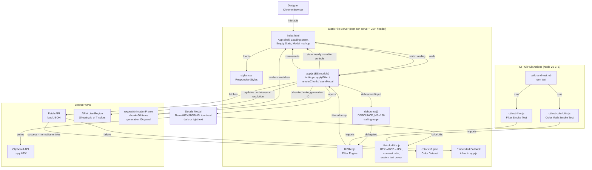
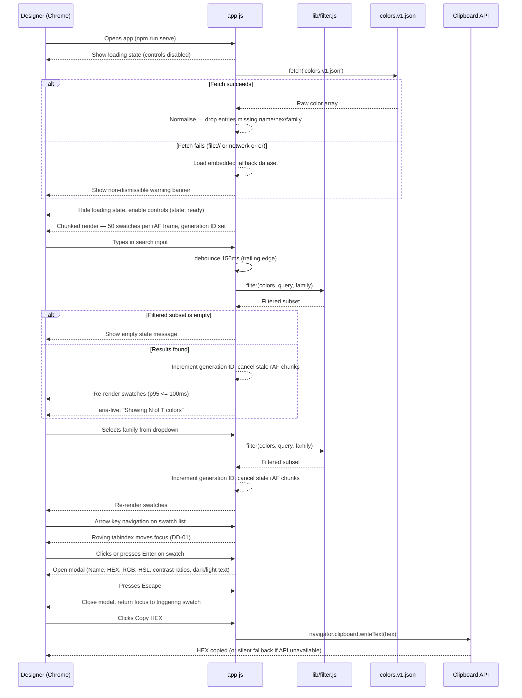

# Architecture: Color Palette Explorer

_Generated: 2026-09-15_
_Based on: docs/requirements.md (JIRA TES-2)_

---

## 1. Architecture Style

**Zero-dependency static SPA** — a single HTML file shell with co-located CSS and JS files, no build step, no bundler, no framework. Served locally via an npm `http-server` script. All logic runs in the browser; the server only delivers static files.

This fits the constraints perfectly: Chrome-only target means no polyfill overhead, pure vanilla JS keeps the prototype simple and maintainable, and a static file serve has zero operational cost.

---

## 2. Component Diagram

---

## 3. Key Components & Responsibilities

| Component | Technology | Responsibility |
|---|---|---|
| `index.html` | HTML5 | App shell: layout skeleton, filter controls, swatch container, loading state, empty state, modal markup, ARIA landmark regions |
| `styles.css` | CSS3 (custom properties, Flexbox, Grid) | Responsive layout, swatch grid, modal overlay, offline banner, warning colour token, loading/empty state styles |
| `app.js` | Vanilla JS ES module (ES2020) | Orchestrator with named exports: `initApp`, `applyFilter`, `renderChunk`, `openModal`. Manages app state machine (`loading → ready \| error`), wires events, drives chunked render with generation ID, controls offline banner |
| `lib/filter.js` | Pure vanilla JS | Stateless filter functions — filter by name query and family; importable by both `app.js` and CI test |
| `lib/colorUtils.js` | Pure vanilla JS | HEX→RGB→HSL conversion, WCAG contrast ratio calculation, swatch text colour selection (dark/light based on relative luminance). Importable by modal and CI test |
| `debounce()` | Vanilla JS (inline utility) | Trailing-edge debounce with `DEBOUNCE_MS = 150`. Wraps filter input handler to throttle DOM updates and `aria-live` announcements |
| Loading State | HTML element in `index.html` | Spinner/skeleton shown on page load; hidden after first chunk renders. Controlled by `app.js` state machine |
| Empty State | HTML element in `index.html` | Message shown when filtered array is empty (EC-02). Hidden by default; shown by `app.js` when `filteredColors.length === 0` |
| `colors.v1.json` | JSON static asset | Master color dataset. Required fields per entry: `name` (string), `hex` (string), `family` (string). Entries missing any required field are dropped during normalisation |
| `ci/test-filter.js` | Node.js (no test framework) | Smoke test for `lib/filter.js` — imported directly, runs with `node` |
| `ci/test-colorUtils.js` | Node.js (no test framework) | Smoke test for `lib/colorUtils.js` — verifies HEX→RGB, contrast ratio, and text colour selection |
| `package.json` | npm | Scripts: `serve` (http-server with CSP header), `test` (runs both CI smoke tests) |
| `.github/workflows/ci.yml` | GitHub Actions (Node 20 LTS) | Runs `npm test` on every pull request |

---

## 4. Technology Choices

| Layer | Recommended | Rationale | Alternative Considered |
|---|---|---|---|
| Markup | HTML5 (semantic) | Native ARIA support, no overhead | — |
| Styling | Vanilla CSS3 + custom properties | Zero dependency; CSS variables for warning colour token | Tailwind — overkill for a prototype |
| Logic | Vanilla JS ES2020 | `fetch`, `Promise`, optional chaining all native in Chrome; no transpile needed | Alpine.js — ruled out (pure vanilla required) |
| Color maths | `lib/colorUtils.js` (pure vanilla JS) | Extracted to a testable module; pure functions with no DOM coupling | chroma.js — unnecessary dependency |
| Local server | `npx http-server --header "Content-Security-Policy: default-src 'self'"` | Zero-install; CSP header restricts script sources at dev-serve time | live-server — no built-in header flag |
| CI | GitHub Actions (Node 20 LTS) | Matches DEP-02; Node version pinned to LTS for reproducible builds | — |
| Test runner | Plain `node` | Both `lib/filter.js` and `lib/colorUtils.js` are pure functions — no DOM, no runner needed | Jest — overkill for smoke tests |

---

## 5. Data Flow

### Flow Description

1. Designer opens the app via `npm run serve` (Chrome, `http://localhost`). Loading state shown; controls disabled.
2. `app.js` calls `fetch('colors.v1.json')`. On success, entries missing `name`/`hex`/`family` are dropped (normalisation). On failure, embedded fallback loaded and warning banner shown.
3. App transitions to `ready` state — loading state hidden, filter controls enabled.
4. Swatches rendered in chunks of **50 per `requestAnimationFrame` frame**. Each render job holds a generation ID; stale jobs self-cancel if the generation has changed.
5. Designer types a search query → **150ms trailing-edge debounce** → `filter.js` runs in-memory → generation ID incremented → stale chunks cancelled → swatches re-rendered. `aria-live` announces `"Showing N of T colors"` once per debounce resolution.
6. Zero results → empty state message shown instead of blank list.
7. Designer selects family from dropdown → same filter pipeline.
8. Arrow keys navigate swatches (roving `tabindex`, `role="listbox"` — DD-01). Enter opens details modal.
9. Details modal shows Name, HEX, RGB, HSL, contrast ratios. Swatch text colour (dark/light) determined by `colorUtils.js` relative luminance.
10. Escape closes modal; focus returns to the triggering swatch.
11. Copy HEX → `navigator.clipboard.writeText(hex)`; silent fallback if Clipboard API unavailable.

---

## 6. Non-Functional Architecture Decisions

| NFR | Architectural Decision |
|---|---|
| Performance — p95 ≤ 100ms | In-memory array filtering (no I/O on keypress); **150ms trailing-edge debounce** on search input; **chunked DOM writes: 50 items per `requestAnimationFrame` frame**; generation ID pattern cancels stale render loops on re-filter |
| Usability / Responsive | CSS Flexbox swatch row with `overflow-x: auto`; media queries for stacking controls on mobile; loading state and empty state prevent blank-screen confusion |
| Accessibility — WCAG 2.1 AA | Semantic HTML; `role="listbox"` with roving `tabindex` on swatch list (arrow-key nav, Enter opens modal, Escape closes — DD-01); `aria-live="polite"` announces `"Showing N of T colors"` once per debounce resolution; focus trap in modal, focus returns to trigger on close; `aria-label` on all controls; swatch text colour (dark/light) set by relative luminance to maintain 4.5:1 contrast (WCAG SC 1.4.3) |
| Security | `textContent` (never `innerHTML`) for all data-derived DOM writes; JSON entries normalised before render; Clipboard API invoked only on explicit user gesture; CSP header `default-src 'self'` served via `http-server --header` flag |
| Maintainability | `lib/filter.js` and `lib/colorUtils.js` are pure modules with no DOM coupling — each independently testable; `app.js` structured as ES module with named exports (`initApp`, `applyFilter`, `renderChunk`, `openModal`) |
| Compatibility — Chrome only | ES2020 syntax (`fetch`, optional chaining, `Promise`, `navigator.clipboard`) used freely; no transpile or polyfill step needed |

---

## 7. Out of Scope

- Server-side rendering or any backend API
- Server-side paging (applicable only if dataset exceeds 20,000 items)
- Production deployment (GitHub Pages, Netlify, CDN, etc.)
- Authentication or user accounts
- Saved or bookmarked palettes
- Multi-browser support (Firefox, Safari, Edge)
- Dataset versioning beyond `colors.v1.json`

---

## 8. Open Architectural Questions

- OAQ-01: Should the offline banner be dismissible? — owner: TBD
- ~~OAQ-02: Keyboard navigation model inside the swatch list: Tab vs. arrow keys? Should Escape close the modal?~~ — **Resolved as DD-01**: `role="listbox"`, roving tabindex, arrow keys, Escape closes modal.
- ~~OAQ-03: Chunked-render batch size?~~ — **Resolved**: 50 items per `requestAnimationFrame` frame (GAP-06).

---

## 9. Revision History

| Date | Change | Trigger |
|---|---|---|
| 2026-09-15 | Added `lib/colorUtils.js`, `ci/test-colorUtils.js`, Loading State, Empty State, `debounce()` utility to component diagram and table | GAP-01, GAP-02, GAP-03, GAP-09 |
| 2026-09-15 | Specified `app.js` as ES module with named exports (`initApp`, `applyFilter`, `renderChunk`, `openModal`) | DECISION-NEEDED-01 |
| 2026-09-15 | Added app state machine (`loading → ready \| error`), controls disabled during load | RISK-01 |
| 2026-09-15 | Added generation ID pattern for stale chunk cancellation to data flow | RISK-02 |
| 2026-09-15 | Added CSP header to `serve` script; documented in technology choices | GAP-04 |
| 2026-09-15 | Added JSON normalisation step (drop entries missing name/hex/family) to data flow | GAP-05 / RISK-04 |
| 2026-09-15 | Specified chunk size = 50 items/frame, debounce = 150ms trailing edge | GAP-06 |
| 2026-09-15 | Specified keyboard nav: `role="listbox"`, roving tabindex, arrow keys, Escape (DD-01); resolved OAQ-02 | RISK-03 |
| 2026-09-15 | Specified aria-live content and trigger: "Showing N of T colors" on debounce resolution | GAP-07 |
| 2026-09-15 | Added swatch text contrast logic (relative luminance → dark/light text) | GAP-08 |
| 2026-09-15 | Pinned Node.js 20 LTS in CI spec; resolved OAQ-03 | GAP-10 |
